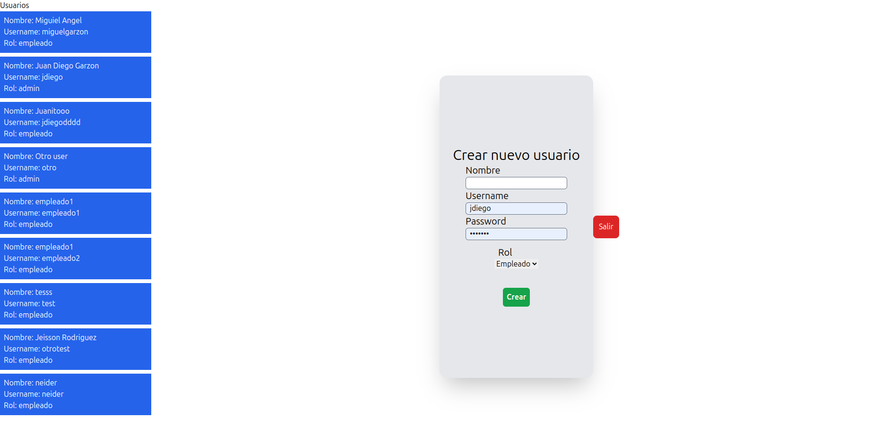
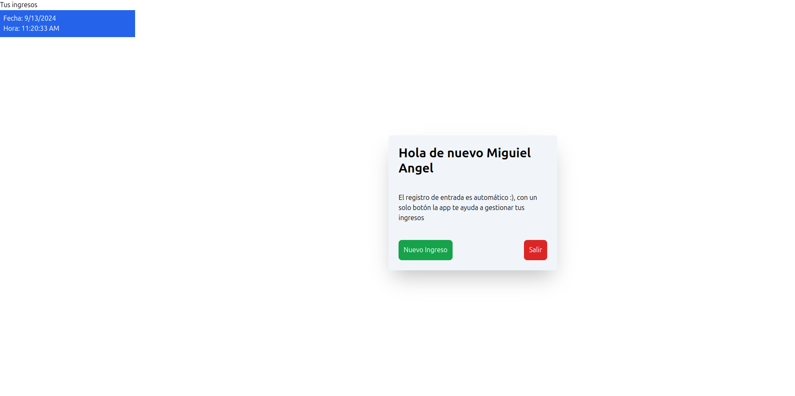

# PruebaTecnica

comandos para correr este proyecto

requisitos:
- Node instalado
- Conexion a internet (Base de datos alojada en mongodb Atlas)

git clone https://github.com/Juandiegogb/PruebaTecnica

## Correr cliente
### crear una nueva consola
cd PruebaTecnica
cd client
npm i 
npm run dev

## Correr servidor
### crear una nueva consola

cd PruebaTecnica
cd server
npm i
npm run dev

# Instrucciones de uso 

## Admin
- ingresar
  - usuario : jdiego
  - password : 1234456

En el lado izquierdo vera la lista de usuarios que tiene la base de datos y con el form podra crear un nuevo usuario

## User
- Ingresar con algun usuario creado anteriormente

En el lado izquierdo vera los ingresos realizado anteriormente con su informacion, en este caso se configuro el backend para realziar un solo registro por día simulando el ingreso a labores en la mañana